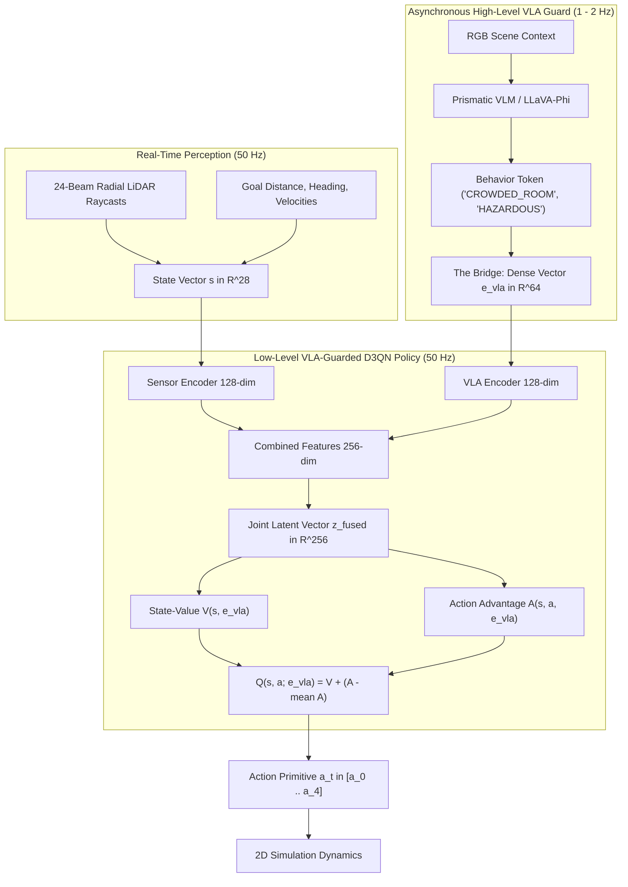

# VLA-Guarded D3QN Autonomous Mobile Robot Navigation System

This project implements a complete, publication-ready **VLA-Guarded Dueling Double Deep Q-Network (VLA-D3QN)** reinforcement learning system to navigate a continuous 2D simulated robot equipped with a 24-beam radial LiDAR in an obstacle-cluttered environment.

By combining an asynchronous **Vision-Language-Action (VLA) High-Level Guard**, a **Multi-Modal Feature Fusion Network**, a **Dueling Neural Network Architecture**, and **Double DQN target updates**, the robot bridges the **Semantic-Safety Gap** in discrete DRL, producing robust, semantically-aware, and collision-free navigation policies.

---

## 🌟 Key Features & Architectural Innovations

1. **VLA Semantic Guarding**: Integrates high-level Vision-Language Model (VLM) behavioral tokens (`"OPEN_WAREHOUSE"`, `"CROWDED_ROOM"`, `"HAZARDOUS_ZONE"`) mapped into a continuous 64-dimensional modulation embedding vector $e_{\text{vla}}$.
2. **Multi-Modal Feature Fusion**: Fuses 28-dimensional sensory features (24 LiDAR beams + 4 goal tracking/velocity features) with 64-dimensional VLA semantic embeddings into a joint 256-dimensional latent representation.
3. **Conditioned Dueling Streams**:
   - **Value Stream $V(s, e_{\text{vla}})$**: Depresses baseline state expectations in dangerous/hazardous rooms.
   - **Advantage Stream $A(s, a, e_{\text{vla}})$**: Dynamically penalizes aggressive forward velocity primitives in crowded spaces.
4. **Asynchronous Latency Caching**: Ensures zero-latency 50 Hz low-level control execution using cached VLA embeddings while high-level VLM vision reasoning runs asynchronously at 1–2 Hz.
5. **Comparative Benchmarking**: Built-in side-by-side benchmarking script (`run_comparative_experiment.py`) comparing Baseline D3QN vs. VLA-Guarded D3QN under controlled random seeds.

---

## 🏗️ Project Architecture & Data Flow



---

## 📁 Repository Structure

```
├── dueling_dqn.py                  # VLAGuardedDuelingDQN PyTorch Model Architecture
├── vla_guard.py                    # High-Level VLA Guard Simulation Module
├── agent.py                        # VLA-Guarded D3QNAgent Class (Caching & Replay)
├── environment.py                  # 2D Kinematics & 24-Beam LiDAR Simulation Environment
├── train.py                        # Main VLA-Guarded D3QN Training Loop Script
├── enjoy.py                        # Evaluation Script & Visual GIF Generator
├── run_comparative_experiment.py   # Side-by-Side Benchmark Script (Baseline vs. VLA-Guarded)
├── export_metrics.py               # Empirical Metric Telemetry CSV Export Script
├── research_paper_details.md       # IEEE Research Paper Draft & Specifications Document
├── requirements.txt                # Dependency File (torch, numpy, matplotlib, pillow)
├── .gitignore                      # Git Ignore File (Ignores venv, pycache, checkpoints)
└── README.md                       # Project Documentation Guide
```

---

## 🚀 How to Run & Reproduce

### 1. Setup Environment
```bash
python3 -m venv venv
source venv/bin/activate
pip install -r requirements.txt
```

### 2. Train VLA-Guarded D3QN Model
```bash
python3 train.py
```

### 3. Evaluate Policy & Generate Navigation GIF
```bash
python3 enjoy.py
```
*Outputs an animated visualization GIF with live VLA Guard token overlays to `plots/vla_guarded_demo.gif`.*

### 4. Run Side-by-Side Benchmark Experiment (Baseline D3QN vs. VLA-Guarded D3QN)
```bash
python3 run_comparative_experiment.py
```
*Outputs comparative plot (`plots/d3qn_vs_vla_guarded_comparison.png`) and per-episode telemetry (`plots/comparative_metrics.csv`).*

---

## 📊 Telemetry & Research Paper Reference
All mathematical MDP formulations, network conditioning equations, LaTeX formulas, academic citations (PaLM-E, RT-2, Prismatic VLMs, SayCan, Nature DQN), and Gemini prompts are compiled in [research_paper_details.md](file:///home/csi/Documents/VSC/PROJECTS/D3QN_Implementation/D3QN_Based_Navigation_Implementation/research_paper_details.md).