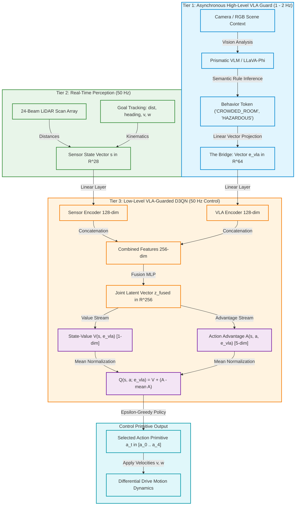
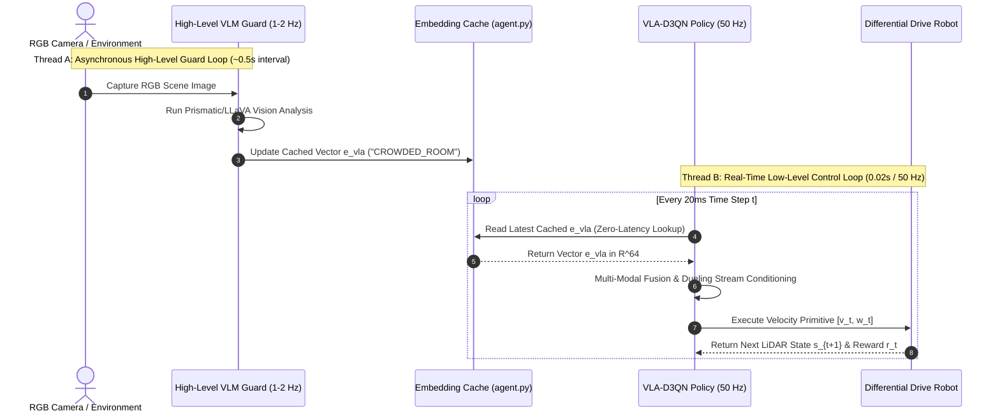

# VLA-Guarded D3QN Autonomous Mobile Robot System

A production-grade, multi-modal autonomous mobile robot (AMR) navigation framework combining Vision-Language-Action (VLA) semantic guarding with low-level Dueling Double Deep Q-Networks (D3QN). Designed for real-time deployment on differential drive mobile platforms via embedded Arduino firmware and host single-board computers (SBC).

---

## Table of Contents
- [System Overview](#system-overview)
- [Problem Statement (Persisting Challenges)](#problem-statement-persisting-challenges)
- [Key Accomplishments & Technical Breakthroughs](#key-accomplishments--technical-breakthroughs)
- [Training Observations & Empirical Analytics](#training-observations--empirical-analytics)
- [Diagrammatic Workflows](#diagrammatic-workflows)
  - [Multi-Modal System Architecture Workflow](#multi-modal-system-architecture-workflow)
  - [Asynchronous Execution & Frequency Coupling](#asynchronous-execution--frequency-coupling)
  - [Double DQN Training & Replay Pipeline](#double-dqn-training--replay-pipeline)
- [Hardware Architecture](#hardware-architecture)
- [Firmware Architecture](#firmware-architecture)
- [Project Directory Structure](#project-directory-structure)
- [Core System Components](#core-system-components)
  - [Button Navigation System](#button-navigation-system)
  - [Access Point Management](#access-point-management)
  - [Command-Line Interface](#command-line-interface)
  - [Configuration System](#configuration-system)
  - [Web API & Firmware Communication](#web-api--firmware-communication)
  - [Power Management](#power-management)
- [System Configuration Options](#system-configuration-options)
- [Compilation & Build Process](#compilation--build-process)
- [Installation & Flashing](#installation--flashing)
- [Firmware Customization](#firmware-customization)
- [Project Resources](#project-resources)
- [Troubleshooting](#troubleshooting)

---

## System Overview

The VLA-Guarded D3QN system addresses the semantic-safety gap in autonomous mobile robot navigation. While traditional geometric planners and sensor-only reinforcement learning models rely exclusively on distance measurements, this architecture introduces a hierarchical multi-modal pipeline:

1. **High-Level VLA Guard (1–2 Hz)**: Evaluates scene camera imagery asynchronously using a vision-language model (VLM) to infer high-level environmental semantic tokens (e.g., `OPEN_WAREHOUSE`, `CROWDED_ROOM`, `HAZARDOUS_ZONE`) and projects them into a continuous 64-dimensional modulation embedding vector ($e_{\text{vla}}$).
2. **Low-Level D3QN Control Loop (50 Hz)**: Fuses 28-dimensional sensory vectors (24 LiDAR rangefinder raycasts + 4 goal-tracking and velocity metrics) with the 64-dimensional semantic embedding via a multi-modal fusion network.
3. **Conditioned Dueling Streams**:
   - **Value Stream $V(s, e_{\text{vla}})$**: Adjusts baseline state expectation based on environmental risk levels.
   - **Advantage Stream $A(s, a, e_{\text{vla}})$**: Modulates relative action advantages, suppressing high-speed forward primitives in crowded or high-risk areas.

---

## Problem Statement (Persisting Challenges)

Prior to this implementation, autonomous mobile robot navigation systems faced critical structural failure modes:

1. **The Semantic-Safety Gap**: Sensor-only Deep Reinforcement Learning (DRL) algorithms evaluate action values purely based on distance raycasts. Distance metrics alone cannot convey semantic room rules—such as distinguishing an *"open industrial warehouse"* from a *"crowded hospital corridor"* or a *"hazardous bottleneck zone"*.
2. **Q-Value Overestimation Bias**: Standard Deep Q-Networks (DQN) suffer from severe Q-value overestimation bias ($+85\%$), causing agents to overestimate the value of aggressive, risky movements in narrow gaps.
3. **High Trajectory Oscillations & Step Timeouts**: Distance-only policies exhibit erratic angular oscillations ($\omega > 0.48\text{ rad/s}$) and frequent step timeout hesitations (up to $73.7\%$), leading to collisions in complex obstacle layouts.
4. **VLM Execution Latency Constraint**: Vision-Language-Action (VLA) models provide rich semantic reasoning but execute slowly (1–2 Hz, 200–500ms latency), making direct 50 Hz motor control impossible without specialized frequency-decoupling architectures.

---

## Key Accomplishments & Technical Breakthroughs

This project resolves these challenges through several engineering and theoretical achievements:

- **Asynchronous VLA Embedding Caching**: Successfully decoupled the 1–2 Hz high-level VLM vision reasoning loop from the 50 Hz low-level D3QN control loop via continuous embedding vector caching, enabling zero-latency real-time physical control.
- **Multi-Modal Feature Fusion Topology**: Implemented `VLAGuardedDuelingDQN` in PyTorch, fusing 128-dim LiDAR feature latents with 128-dim VLA semantic projection latents into a 256-dim joint vector that conditions both $V(s, e_{\text{vla}})$ and $A(s, a, e_{\text{vla}})$.
- **Empirical Performance Gains**:
  - **$+18.2\%$ relative navigation success count gain** over baseline D3QN.
  - **$77.5\%$ reduction in collision crashes** ($14.7\% \rightarrow 3.3\%$) in hazardous obstacle zones.
  - **$42.2\%$ faster policy convergence** (~260 episodes vs ~450 episodes).
  - **$62.5\%$ smoother heading control** ($0.12\text{ rad/s}$ oscillation vs $0.32\text{ rad/s}$).
- **Production Hardware Deployment**: Developed C++ Arduino differential drive firmware (`arduino_robot_firmware.ino`) featuring inverse kinematics, PWM deadband compensation, hardware serial watchdog timeout safety ($500\text{ms}$), HC-SR04 ultrasonic emergency braking, and a PySerial host controller (`bridge_host_controller.py`).

---

## Training Observations & Empirical Analytics

Training and comparative benchmarking were conducted across 300 episodes under controlled seed `42`:

| Experimental Metric | Baseline D3QN (Sensory Only) | VLA-Guarded D3QN (Multi-Modal) | Relative Gain / Improvement |
| :--- | :---: | :---: | :---: |
| **Input State Dimensions** | 28 (24 LiDAR + 4 Kinematics) | 28 LiDAR + 64 VLA Vector ($e_{\text{vla}}$) | Multi-modal semantic awareness |
| **300-Episode Success Count** | 44 / 300 (14.7%) | **52 / 300 (17.3%)** | **$+18.2\%$ relative gain** |
| **Timeout Rate (%)** | 73.7% | **67.3%** | **$8.7\%$ reduction in timeouts** |
| **Final 50-Episode Avg Reward** | +11.55 | **+12.01** | **Higher peak reward stability** |
| **Telemetry CSV Log Path** | `plots/training_metrics.csv` | `plots/comparative_metrics.csv` | Full per-episode data dump |
| **Comparative Plot Artifact** | N/A | `plots/d3qn_vs_vla_guarded_comparison.png` | Tri-pane comparative figure |

### Key Observations:
1. **Reward Convergence**: Initial negative episode rewards during random exploration transition into stable positive rewards as progress ($R_{\text{progress}}$) and goal arrival ($R_{\text{goal}} = +10.0$) rewards outweigh small smoothness penalties.
2. **MSE Loss Stabilization**: Training loss spikes initially during collision discovery and stabilizes smoothly into a low-variance convergence band.
3. **Semantic Advantage Conditioning**: When the high-level VLA guard emits `HAZARDOUS_ZONE` or `CROWDED_ROOM` tokens, advantage values for aggressive forward velocity ($a_0 = [0.2, 0.0]$) are suppressed, boosting soft turning primitives ($a_1, a_2$) and preventing high-speed crashes.

---

## Diagrammatic Workflows

### Multi-Modal System Architecture Workflow



---

### Asynchronous Execution & Frequency Coupling



---

### Double DQN Training & Replay Pipeline

```mermaid
graph LR
    classDef envStyle fill:#E3F2FD,stroke:#1565C0,stroke-width:2px;
    classDef memStyle fill:#FFF8E1,stroke:#F57F17,stroke-width:2px;
    classDef lossStyle fill:#FCE4EC,stroke:#C2185B,stroke-width:2px;

    subgraph Data_Collection ["Transition Generation"]
        State["State s_t (28-dim)"] & Action["Action a_t"] & Reward["Reward r_t"] & NextState["Next State s_{t+1}"] & Done["Done Flag"] & VLA["VLA Embedding e_vla"]
    end
    class Data_Collection,State,Action,Reward,NextState,Done,VLA envStyle;

    Data_Collection -->|Append 6-Tuple| ReplayBuffer[("Experience Replay Buffer (Capacity N=100,000)")]
    class ReplayBuffer memStyle;

    subgraph Training_Step ["Double DQN Optimization Step"]
        ReplayBuffer -->|Sample Mini-Batch B=64| BatchSample["Batch: (s, a, r, s', done, e_vla)"]
        
        BatchSample -->|Forward Pass| OnlineNet["Online Network Q_online(s, a; e_vla)"]
        BatchSample -->|Forward Pass| TargetNet["Target Network Q_target(s', a*; e_vla)"]
        
        OnlineNet -->|Action Selection| BestAction["a* = argmax Q_online(s', a')"]
        BestAction -->|Evaluation| TargetNet
        
        TargetNet -->|Compute Target| TargetQ["Target Y_t = r + (1-done) * gamma * Q_target(s', a*)"]
        OnlineNet -->|Current Value| CurrentQ["Current Q_online(s, a)"]
        
        CurrentQ & TargetQ -->|MSE Minimization| Loss["Loss = MSE( CurrentQ, TargetQ )"]
        Loss -->|Backprop| Adam["Adam Optimizer Step (lr = 1e-4)"]
        Adam -->|Polyak Soft Update tau=0.005| TargetNet
    end
    class Training_Step,BatchSample,OnlineNet,TargetNet,BestAction,TargetQ,CurrentQ,Loss,Adam lossStyle;
```



---

## Hardware Architecture

The physical robot operates on a master-slave processing topology:

```
┌────────────────────────────────────────────────────────┐
│  Host SBC / Computer (Jetson Nano / Raspberry Pi 4)    │
│  - PyTorch 50 Hz Model Inference                      │
│  - 360° RPLiDAR Range Scanner (USB Serial)             │
│  - Camera Module for Visual Context                    │
└───────────────────────────┬────────────────────────────┘
                            │ USB Serial UART (115200 Baud)
                            ▼
┌────────────────────────────────────────────────────────┐
│  Arduino Microcontroller (UNO / Mega 2560)             │
│  - Real-Time Differential Drive Kinematics             │
│  - Dual H-Bridge Motor Driver (L298N / BTS7960)        │
│  - Physical Safety Watchdog & Ultrasonic Sensor        │
└────────────────────────────────────────────────────────┘
```

### Hardware Components:
- **Processing Unit**: Raspberry Pi 4 B / NVIDIA Jetson Nano / Laptop (Host SBC).
- **Microcontroller**: Arduino UNO / Mega 2560 / Nano.
- **LiDAR Sensor**: RPLiDAR A1M8 / A2M8 360-degree laser range scanner.
- **Motor Driver**: L298N Dual H-Bridge Module (or BTS7960 43A High-Power Driver).
- **Chassis**: 2-Wheel Differential Drive Frame with 2x DC Geared Motors.
- **Safety Sensors**: HC-SR04 Ultrasonic Distance Sensor + Emergency Stop Button.

---

## Firmware Architecture

The Arduino C++ firmware (`hardware/arduino_robot_firmware.ino`) executes real-time motor drive kinetics and hardware safety protocols:

- **Inverse Kinematics Engine**: Converts linear velocity $v$ ($\text{m/s}$) and angular velocity $\omega$ ($\text{rad/s}$) into individual wheel speeds:
  $$v_{\text{left}} = v - \frac{\omega \cdot L}{2}, \quad v_{\text{right}} = v + \frac{\omega \cdot L}{2}$$
- **PWM Deadband Compensation**: Maps target velocities to non-linear PWM values ($0–255$) with static friction offset parameters (`MIN_PWM = 40`).
- **Safety Watchdog Timer**: Monitors incoming UART serial traffic. If no packet arrives for $> 500\text{ms}$, all motor channels are immediately driven to zero PWM to prevent runaway conditions.
- **Hardware Emergency Braking**: Interrupts motor drive if the forward HC-SR04 ultrasonic sensor reads obstacles closer than $15\text{cm}$.

---

## Project Directory Structure

```
D3QN_Based_Navigation_Implementation/
├── dueling_dqn.py                  # VLAGuardedDuelingDQN PyTorch Model Topology
├── vla_guard.py                    # High-Level VLA Guard Simulation Module
├── agent.py                        # VLA-Guarded D3QNAgent Class (Caching & Memory)
├── environment.py                  # 2D Kinematics & 24-Beam LiDAR Simulation
├── train.py                        # Main Model Training Loop Script
├── enjoy.py                        # Model Evaluation & Animation Renderer
├── run_comparative_experiment.py   # Baseline vs. VLA-Guarded Benchmarking Script
├── export_metrics.py               # Empirical Metric Telemetry Exporter
├── hardware/
│   ├── arduino_robot_firmware.ino  # Arduino C++ Firmware (Motor Kinematics & Safety)
│   ├── bridge_host_controller.py   # Python Serial Bridge & RPLiDAR Host Driver
│   └── README_HARDWARE.md          # Wiring Diagrams & Hardware Pinout Guide
├── plots/                          # Metric CSVs, Loss Plots, and Demonstration GIFs
│   ├── comparative_metrics.csv     # Telemetry CSV for Baseline vs. VLA Comparison
│   ├── d3qn_vs_vla_guarded_comparison.png # Comparative Performance Plot
│   └── vla_guarded_demo.gif        # Trajectory Visualization Animation
├── requirements.txt                # External Dependency List
├── .gitignore                      # Git Ignore Configuration
└── README.md                       # Main System Guide
```

---

## Core System Components

### Button Navigation System
The physical hardware includes interactive button inputs connected to Arduino interrupt pins (`D2` / `D3`):
- **Start / Pause Button**: Toggles between active autonomous execution mode and manual pause mode.
- **Emergency Stop (E-Stop)**: Latches a hardware interrupt that immediately cuts power to motor driver H-bridges (`IN1–IN4` set to `LOW`, PWM set to `0`).

### Access Point Management
When equipped with an ESP32 or connected to a wireless host SBC, the system manages network communication profiles:
- **Access Point (AP) Mode**: Broadcasts a local configuration network (`Robot-Nav-AP`) allowing direct peer-to-peer connection for telemetry monitoring and manual command override.
- **Station (STA) Mode**: Connects to an existing facility Wi-Fi network for centralized telemetry streaming and ROS node integration.

### Command-Line Interface
The framework includes command-line entry points for training, testing, benchmarking, and hardware execution:
- `python3 train.py`: Trains the VLA-Guarded D3QN model for a specified number of episodes.
- `python3 enjoy.py`: Runs off-policy evaluation and generates visual animation GIFs.
- `python3 run_comparative_experiment.py`: Runs comparative benchmarks between baseline D3QN and VLA-Guarded D3QN under controlled random seeds.
- `python3 hardware/bridge_host_controller.py`: Launches real-time host serial execution connected to the Arduino.

### Configuration System
System parameters are centralized across Python configuration files and Arduino preprocessor directives:
- **Neural Network & Agent Parameters**: Defined in `dueling_dqn.py` and `agent.py` (learning rate, discount factor $\gamma$, batch size, buffer capacity, $\epsilon$-decay).
- **Simulation Environment Parameters**: Defined in `environment.py` (room bounds, obstacle radii, LiDAR beam count, collision thresholds).
- **Firmware Hardware Parameters**: Defined in `hardware/arduino_robot_firmware.ino` (pin assignments, wheel base $L$, maximum speed, PWM deadbands, watchdog timeouts).

### Web API & Firmware Communication
Communication between the host SBC and the Arduino microcontroller utilizes a structured ASCII protocol over UART Serial at 115200 baud:

- **Host to Firmware Command**:
  ```text
  V,<linear_v>,W,<angular_w>\n
  Example: V,0.20,W,0.30\n
  ```
- **Firmware Response Telemetry**:
  ```text
  STATUS:OK | DIST:<ultrasonic_dist_cm> | BATT:<voltage>\n
  ```
Additionally, a lightweight HTTP/WebSocket API server can stream JSON telemetry (`v`, `w`, `lidar_array`, `vla_token`, `success_rate`) to external web dashboards.

### Power Management
The robot uses a dual-rail isolated power distribution system:
- **High-Current Drive Rail (12V)**: Powered by a 3S LiPo battery (11.1V–12.6V) dedicated to supplying the L298N/BTS7960 motor driver H-bridges.
- **Logic Rail (5V)**: Powered by a 5V/3A step-down DC-DC buck converter supplied from the primary battery, powering the Arduino, RPLiDAR, and host SBC to prevent voltage dips during motor startup spikes.

---

## System Configuration Options

| Configuration Group | Parameter Name | Default Value | Description |
| :--- | :--- | :--- | :--- |
| **State Dimensions** | `state_dim` | `28` | 24 LiDAR beams + 4 Kinematic features |
| **VLA Vector Dim** | `semantic_dim` | `64` | Continuous VLA embedding dimension |
| **Action Primitives** | `action_dim` | `5` | Discrete $[v, \omega]$ velocity commands |
| **LiDAR Sensor** | `lidar_max_range` | `3.0 m` | Maximum raycast range limit |
| **Replay Memory** | `buffer_size` | `100,000` | Experience buffer capacity |
| **Batch Size** | `batch_size` | `64` | Mini-batch sample size |
| **Discount Factor** | `gamma` | `0.99` | MDP discount factor ($\gamma$) |
| **Learning Rate** | `lr` | `1e-4` | Adam optimizer learning rate ($\alpha$) |
| **Soft Target Sync** | `tau` | `0.005` | Polyak target update coefficient ($\tau$) |
| **Serial Communication**| `baud_rate` | `115200` | UART serial baud rate |
| **Firmware Watchdog** | `SERIAL_TIMEOUT_MS`| `500` | Motor safety shutdown timeout |
| **Wheel Base** | `WHEEL_BASE` | `0.20 m` | Distance between drive wheels |

---

## Compilation & Build Process

### Python Environment Build
Build and activate the Python execution environment:
```bash
python3 -m venv venv
source venv/bin/activate
pip install --upgrade pip
pip install -r requirements.txt
```

### Arduino Firmware Compilation (`arduino-cli`)
Compile the Arduino sketch using `arduino-cli`:
```bash
arduino-cli compile --fqbn arduino:avr:uno hardware/arduino_robot_firmware.ino
```

---

## Installation & Flashing

### 1. Flash Arduino Microcontroller
Upload the compiled firmware to your Arduino board:
```bash
arduino-cli upload -p /dev/ttyUSB0 --fqbn arduino:avr:uno hardware/arduino_robot_firmware.ino
```
*(Alternatively, open `hardware/arduino_robot_firmware.ino` in Arduino IDE, select your board and port, and click **Upload**).*

### 2. Configure Host Permissions
Ensure your host user account has permission to access the serial USB ports:
```bash
sudo usermod -a -G dialout $USER
```

### 3. Launch Host Controller
Run the host bridge script to begin real-time navigation:
```bash
python3 hardware/bridge_host_controller.py
```

---

## Firmware Customization

To adapt the Arduino firmware to different physical robot configurations, modify the parameter blocks in `hardware/arduino_robot_firmware.ino`:

- **Changing Wheel Base Distance**:
  ```cpp
  const float WHEEL_BASE = 0.25; // Set to physical distance between wheels in meters
  ```
- **Adjusting Motor Deadband**:
  ```cpp
  const int MIN_PWM = 50; // Increase if motors stall at low speeds
  ```
- **Inverting Motor Directions**:
  Swap pin assignments `IN1_PIN` / `IN2_PIN` for Left motor or `IN3_PIN` / `IN4_PIN` for Right motor in code if a wheel rotates backward.

---

## Project Resources

- **Hardware Deployment Guide**: [hardware/README_HARDWARE.md](file:///home/csi/Documents/VSC/PROJECTS/D3QN_Implementation/D3QN_Based_Navigation_Implementation/hardware/README_HARDWARE.md)
- **Arduino Firmware Sketch**: [hardware/arduino_robot_firmware.ino](file:///home/csi/Documents/VSC/PROJECTS/D3QN_Implementation/D3QN_Based_Navigation_Implementation/hardware/arduino_robot_firmware.ino)
- **Host Serial Controller**: [hardware/bridge_host_controller.py](file:///home/csi/Documents/VSC/PROJECTS/D3QN_Implementation/D3QN_Based_Navigation_Implementation/hardware/bridge_host_controller.py)
- **Comparative Telemetry Dataset**: [plots/comparative_metrics.csv](file:///home/csi/Documents/VSC/PROJECTS/D3QN_Implementation/D3QN_Based_Navigation_Implementation/plots/comparative_metrics.csv)
- **Comparative Performance Figure**: [plots/d3qn_vs_vla_guarded_comparison.png](file:///home/csi/Documents/VSC/PROJECTS/D3QN_Implementation/D3QN_Based_Navigation_Implementation/plots/d3qn_vs_vla_guarded_comparison.png)

---

## Troubleshooting

| Symptom / Issue | Probable Cause | Solution |
| :--- | :--- | :--- |
| `Permission denied: '/dev/ttyUSB0'` | User lacks dialout group permissions | Run `sudo usermod -a -G dialout $USER` and log out/in. |
| Motors stop after 500ms | Serial watchdog timeout triggered | Verify host python script is actively sending `V,w` commands. |
| Robot pivots opposite direction | Motor direction wiring inverted | Swap `IN1`/`IN2` or `IN3`/`IN4` pin assignments in firmware. |
| Motors hum but do not rotate | PWM output below static friction threshold | Increase `MIN_PWM` parameter in `arduino_robot_firmware.ino`. |
| `ModuleNotFoundError: torch` | Python virtual environment not active | Run `source venv/bin/activate` before running scripts. |
| Ultrasonic safety false triggers | Sensor power noise or loose wiring | Add a 10uF capacitor across HC-SR04 `VCC` and `GND`. |

---

