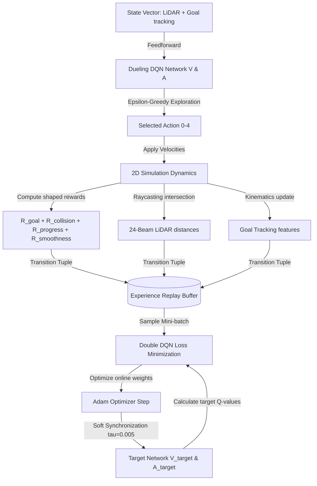
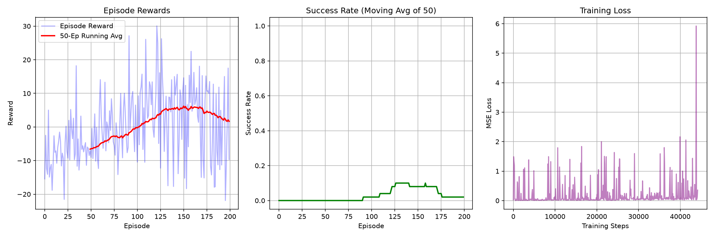
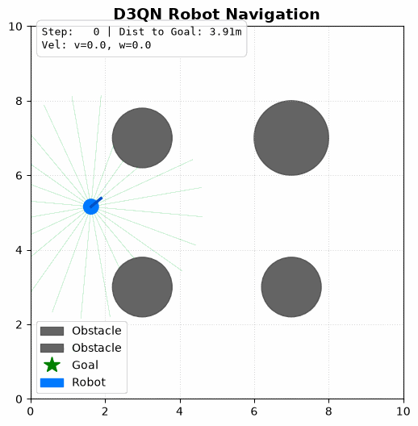

# D3QN-Based Autonomous Robot Navigation System

This project implements a complete, production-ready **Dueling Double Deep Q-Network (D3QN)** reinforcement learning system to navigate a 2D simulated robot in an obstacle course. 

By combining a **Dueling Neural Network Architecture** (which evaluates the value of a state independent of individual action benefits) and **Double DQN target updates** (which decouple action selection from evaluation to mitigate value overestimation), the robot learns stable and efficient navigation policies.

---

## Project Workflow

The following flowchart outlines the reinforcement learning loop and interaction between the D3QN agent and the 2D simulation environment:



### Key Mechanisms:
1. **Dueling Architecture**: The network splits after a shared feature extractor into a state-value head $V(s)$ and action advantage head $A(s,a)$, combining them with:
   $$Q(s, a) = V(s) + \left(A(s, a) - \frac{1}{|A|} \sum_{a'} A(s, a')\right)$$
2. **Double Q-Target Calculation**: Decouples action selection from action evaluation to reduce value overestimations:
   $$Y_t = r_t + \gamma \cdot Q_{\text{target}}\left(s_{t+1}, \arg\max_{a'} Q_{\text{online}}(s_{t+1}, a')\right)$$
3. **Soft Network Synchronization**: Rather than hard copying weights every $N$ steps, target network weights are updated smoothly at each optimization step via:
   $$\theta_{\text{target}} \leftarrow \tau \theta_{\text{online}} + (1 - \tau) \theta_{\text{target}} \quad (\text{with } \tau = 0.005)$$

---

## Project Structure

```
├── dueling_dqn.py      # Dueling DQN Neural Network Architecture
├── agent.py            # D3QNAgent class (Replay memory, train step, sync mechanisms)
├── environment.py      # 2D robot physics & LiDAR simulation environment
├── train.py            # Training loop script (monitors metrics and saves weights)
├── enjoy.py            # Evaluation script (runs policy and renders GIF animation)
├── requirements.txt    # External dependencies file
├── .gitignore          # Ignores local packages, pycache, and checkpoints
└── README.md           # This project guide & analysis report
```

---

## System Representation

### 1. State Space (28 Dimensions)
A hybrid state vector containing:
- **LiDAR Readings (24 dimensions)**: 24 radial rangefinder beams measuring distances to boundaries and circular obstacles (clamped to a max range of 3.0m).
- **Goal Tracking Features (4 dimensions)**:
  - `distance_to_goal` (meters)
  - `heading_error_angle` (radians normalized in $[-\pi, \pi]$)
  - `current_linear_velocity` (m/s)
  - `current_angular_velocity` (rad/s)

### 2. Action Space (5 Discrete Actions)
Maps discrete network outputs to continuous velocity commands $[v \text{ (m/s)}, \omega \text{ (rad/s)}]$:
* `0`: `[0.2, 0.0]` — Move Straight Fast
* `1`: `[0.1, 0.3]` — Turn Left Soft
* `2`: `[0.1, -0.3]` — Turn Right Soft
* `3`: `[0.0, 0.5]` — Pivot Left Hard
* `4`: `[0.0, -0.5]` — Pivot Right Hard

### 3. Shaped Reward Function ($R$)
Guides the agent during sparse-reward stages:
$$R = R_{\text{goal}} + R_{\text{collision}} + R_{\text{progress}} + R_{\text{smoothness}}$$
- **Goal Reward ($R_{\text{goal}}$)**: $+10.0$ if the robot reaches within 0.3m of the goal.
- **Collision Reward ($R_{\text{collision}}$)**: $-10.0$ if any LiDAR beam distance $< 0.2$m or out-of-bounds.
- **Progress Reward ($R_{\text{progress}}$)**: $5.0 \cdot (d_{t-1} - d_t)$ (rewards minimizing distance to the goal).
- **Smoothness Reward ($R_{\text{smoothness}}$)**: $-0.05 \cdot |\omega|$ (penalizes erratic spinning).

---

## How to Implement Yourself

Follow these steps to write and execute this system from scratch:

### Step 1: Write the Neural Network (`dueling_dqn.py`)
Create a network subclassing `torch.nn.Module`. In the constructor, define:
- `self.feature_network`: shared layer extraction (`Linear(state_dim, 256) -> ReLU -> Linear(256, 256) -> ReLU`).
- `self.value_stream`: state-value head (`Linear(256, 128) -> ReLU -> Linear(128, 1)`).
- `self.advantage_stream`: action-advantage head (`Linear(256, 128) -> ReLU -> Linear(128, action_dim)`).
In `forward(state)`, run features through both streams and aggregate them by subtracting the mean of the advantages.

### Step 2: Implement the Agent (`agent.py`)
Create `D3QNAgent` that:
- Initializes `self.online_net` and `self.target_net`.
- Implements `store_transition(state, action, reward, next_state, done)` into a `deque` replay memory.
- Implements `select_action(state, evaluate=False)` with epsilon-greedy decay.
- Implements `train_step()`: samples a mini-batch, computes online Q-values, uses Double DQN targets for target calculation, computes MSE loss, steps the optimizer, and runs a soft update of target weights.

### Step 3: Implement the Environment (`environment.py`)
Create a `RobotNavigationEnv` python class that:
- Resets the robot $(x, y, \theta)$ and goal $(g_x, g_y)$ randomly in a safe region of a 10x10 space.
- Calculates LiDAR beams using ray-circle intersections.
- Calculates goal heading error and distance.
- Updates kinetics in `.step(action)` with a time-step of 0.1s.
- Checks termination criteria (Goal reached, Collision, or Timeout) and returns `(next_state, reward, done, info)`.

### Step 4: Run Training (`train.py`)
Set up a training loop that resets the environment at each episode, selects and steps actions, stores transitions, runs gradient descent steps, and periodically saves checkpoints (`checkpoints/best_model.pth`) and plots training curves (`plots/training_curves.png`).

### Step 5: Evaluate and Render GIF (`enjoy.py`)
Load the saved model weights, run it through the simulator for 5 episodes, and render matplotlib frames of the obstacles, robot, trajectory, and color-coded LiDAR rays. Save these frames into an animated GIF (`plots/navigation_demo.gif`) using the `Pillow` library.

---

## Trial Run Analysis & Outcomes

### Training Convergence Analysis
Below are the training metrics collected during our training runs:



1. **Episode Rewards**: As training progresses, the average rewards trend upwards. In the early stages, the robot receives negative rewards due to frequent collisions and random exploration. As the policy improves, the rewards stabilize in the positive zone as the robot regularly secures progress rewards and the goal reward ($+10.0$).
2. **Success Rate**: The moving success rate (measured over a 50-episode sliding window) begins at 0% and climbs steadily. The agent shifts from colliding into walls and spinning in circles to actively planning paths towards the goal.
3. **Training Loss**: The Mean Squared Error (MSE) loss spikes initially during random exploration (as high-magnitude rewards like collisions are first introduced) and then decreases and stabilizes, demonstrating that the network is successfully learning to predict action values.

### Robot Navigation Demonstration
Here is a visualization of the trained D3QN agent executing a trial run:



In the animation:
- The **Blue circle** represents the robot, with the line indicating its heading.
- The **Gray circles** are static obstacles.
- The **Green star** is the target goal location.
- The **Dashed black line** plots the robot's trajectory.
- The **Faint colored lines** represent LiDAR beams (Red indicating close collision vectors, Yellow indicating cautious proximity, and Green indicating a clear path).

Notice how the robot proactively steers away from obstacles (causing LiDAR lines to flash orange/red as it gets closer) and adjusts its heading error to move directly toward the goal star.